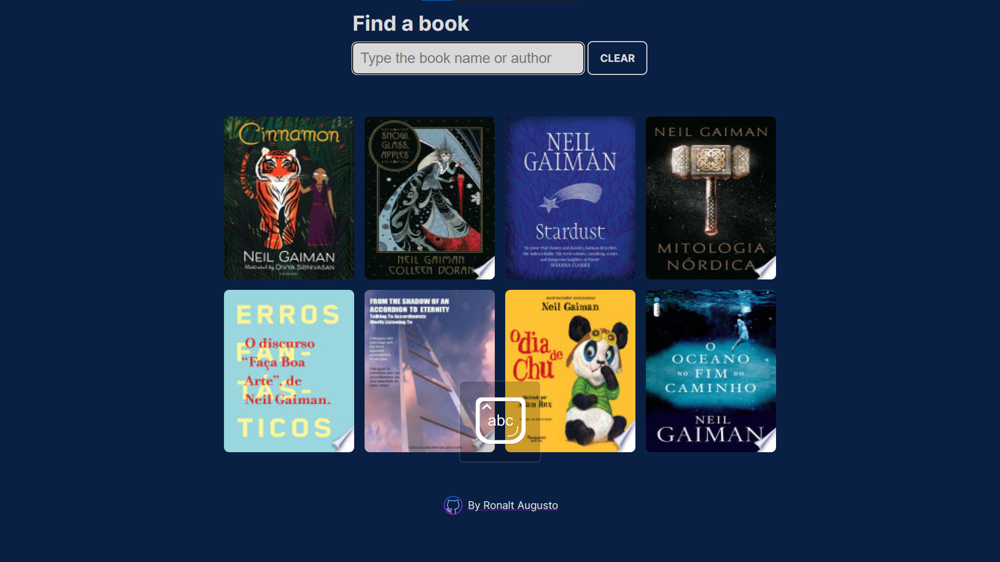

# Find books | Encontre livros
- En | This project is a simple book finder by name or author that returns a list of 8 books
through the google books API.

- Pt-Br | Este projeto é um simples buscador de livros por nomes ou autores que retorna uma lista de 8 livros
através da API  de livros do google.

## Funcionalities | Funcionalidades
>En
* Search with enter 
* Click on the image to open a modal with more infos about the book
>Pt-br
* Pesquise com enter
* Clique na imagem para abrir um modal com mais informações sobre o livro

## Demonstration | Demonstração

> Press `CTRL` + `click` to open in new tab
https://ronalt4cs.github.io/Find-books/

## 🔗 Links

